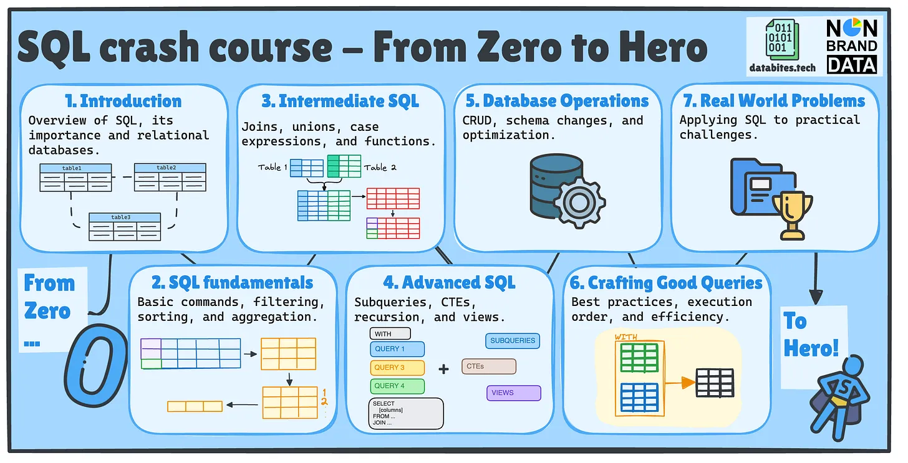

# SQL Crash Course – From Zero to Hero! 🚀

Hi! You must be here because of our's ([Cornellius from Non-Brand Data](https://www.nb-data.com/) and [Josep from databites.tech](https://www.databites.tech/)) newest SQL Crash Course.

Whether you're just starting out or looking to sharpen your SQL skills, this series will take you from zero to hero with a structured, easy-to-follow approach. Each post will break down essential SQL concepts, helping you build confidence in SQL following the same style as my previous courses.

## What’s in the Course?

We will structure the series into seven key topics to guide you step by step:

1. **Introduction** – What SQL is and why it matters
2. **SQL Fundamentals** – Basic commands, filtering, and aggregation
3. **Intermediate SQL** – Joins, unions, and functions
4. **Advanced SQL** – Subqueries, CTEs, recursion, and views
5. **Database Operations** – CRUD, schema changes, and optimization
6. **Crafting Good SQL Queries** – Best practices for writing efficient queries
7. **Real-world Problems** – Applying SQL to practical challenges

The repository will be updated over time with all the articles and code used in the series, so stay tuned!

## Table of Contents
| Article Title | Article Link | Code Script | SQL Playground |
|---------------|--------------|-------------|----------------|
| Launching the SQL Crash Course – From Zero to Hero! 🚀 | [Read here](https://www.databites.tech/p/launching-the-sql-crash-course-from) |  |  |
| #1 What is SQL? | [Read here](https://www.nb-data.com/p/2-what-is-sql) |  |  |
| #2 Why learn SQL? | [Read here](https://www.databites.tech/p/2-why-learn-sql) |  |  |
| #3 Relational Data & Models | [Read here](https://www.databites.tech/p/3-relational-data-and-models) |  |  |
| #4 SQL Basic Commands | [Read here](https://www.nb-data.com/p/4-sql-basic-commands) | [View script](sql_scripts/Theory/04_SQL_Basic_Commands.sql) | [Run playground](https://www.db-fiddle.com/f/tLA6Ca3iAcABo7Bkgm87nE/1) |
|#5 Sorting & Limiting | [Read here](https://www.databites.tech/p/5-sorting-and-limiting) | [View script](sql_scripts/Theory/05_Sorting_and_Limiting.sql)| [Run playground](https://www.db-fiddle.com/f/gsJfafADqkwjrHBLernRZP/0) |
|#6 Aggregate Functions | [Read here](https://www.nb-data.com/p/6-aggregate-functions) | [View script](sql_scripts/Theory/06_Aggregate_Functions.sql) | [Run playground](https://www.db-fiddle.com/f/w3trdsFQ23og1tYerokVMm/0) |
|#7 JOINs (Left, Right, Inner & Full) | [Read here](https://www.databites.tech/p/7-joins-left-right-inner-and-full) | [View script](sql_scripts/Theory/07_Join.sql) | [Run playground](https://www.db-fiddle.com/f/8rkgKHYSFEmmhjdR9P4iii/3) |
|#8 UNION & UNION ALL | [Read here](https://www.nb-data.com/p/8-union-and-union-all) | [View script](sql_scripts/Theory/08_Union.sql) | [Run playground](https://www.db-fiddle.com/f/pTrpDgGYGejUmAMXTtaQNm/2) |
|#9 Case Expressions | [Read here](https://www.databites.tech/p/9-case-expressions) | [View script](sql_scripts/Theory/09_CASE.sql) | [Run playground](https://www.db-fiddle.com/f/sTGiHfN435PP2xCSWGd5q7/0) |
|#10 Functions | [Read here](https://www.nb-data.com/p/10-functions-string-date-numeric) | [View script](sql_scripts/Theory/10_Functions.sql) | [Run playground](https://www.db-fiddle.com/f/oEaniab9PUi1eCJUqk7xjL/0) |
|#11 Subqueries | [Read here](https://www.nb-data.com/p/11-subqueries) | [View script](sql_scripts/Theory/11_Subqueries.sql) | [Run playground](https://www.db-fiddle.com/f/orVEkoyFQhhppyGtSrZzYA/0) |
|#12 Common Table Expressions (CTEs) | [Read here](https://www.databites.tech/p/12-common-table-expressions-ctes) | [View script](sql_scripts/Theory/12_CTEs.sql) | [Run playground](https://www.db-fiddle.com/f/tvtNVuMuynXcBM3ADX5ymp/0) |
|#13 Recursion | [Read here](https://www.nb-data.com/p/13-recursion) | [View script](sql_scripts/Theory/13_Recursion.sql) | [Run playground](https://www.db-fiddle.com/f/wkeRysp7ZDzzrA9yPLYuJm/0) |
|#14 Views | [Read here](https://www.databites.tech/p/14-views) | [View script](sql_scripts/Theory/14_Views.sql) | [Run playground](https://www.db-fiddle.com/f/vht5JRmZEFXFguackAoMJW/0) |
|#15 CRUD Operations | [Read here](https://www.nb-data.com/p/15-crud-operations) | [View script](sql_scripts/Theory/15_CRUD_Operations.sql) | [Run playground](https://www.db-fiddle.com/f/wKgWsY7o6ua4u7EedRrfco/1) |
|#16 Dabase Modifications | [Read here](https://www.databites.tech/p/16-database-modifications) | [View script](sql_scripts/Theory/16_Database_modifications.sql) | [Run playground](https://www.db-fiddle.com/f/fLFqwktLC3vQadZKnqZf8o/0) |
|#17 Indexing and Optimization | [Read here](https://www.nb-data.com/p/17-indexing-and-optimization) | [View script](sql_scripts/Theory/17_Indexing_and_Optimization.sql) | [Run playground](https://www.db-fiddle.com/f/pvMeVUQx5MNp2333YyJjPu/0) |
|#18 Modular Code | [Read here](https://www.databites.tech/p/18-generating-modular-code) | [View script](sql_scripts/Theory/18_Modular_Code.sql) | [Run playground](https://www.db-fiddle.com/f/ezePzh6hZtarATN33nuHRV/1) |
|#19 SQL Execution Order | [Read here](https://www.databites.tech/p/19-sql-execution-order) | [View script](sql_scripts/Theory/19_execution_order.sql) | [Run playground](https://www.db-fiddle.com/f/vgfg4bJUzYuxPNvNQHThqB/1) |
|#20 Query Optimization | [Read here](https://www.nb-data.com/p/20-query-optimization)|[View script](sql_scripts/Theory/20_query_optimization.sql) | [Run playground](https://www.db-fiddle.com/f/qXW9oG2DpFE8aFkzV8zUMV/1) |